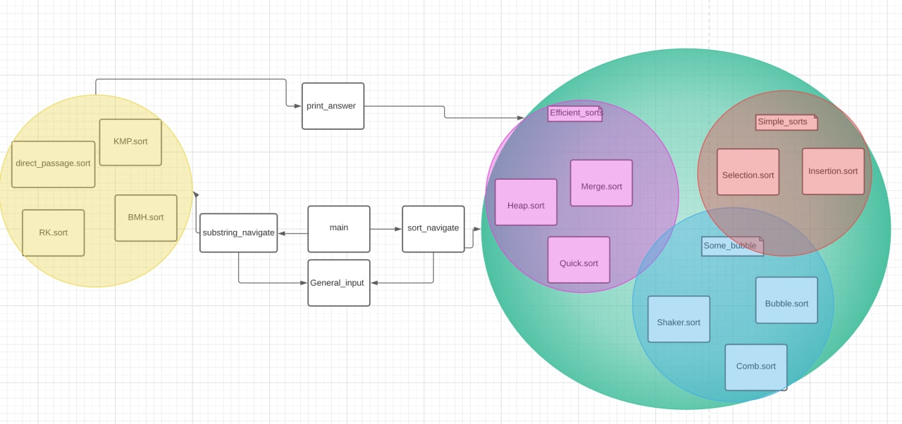

 

 
Описание алгоритмов лежит в файлах README в папках с реализацией  

Документация -  pydoc   
Тесты - pytest 
<h3>Алгоритмы сортировок : </h3>

| Название                         | Сложность  |          Готовность       |
|----------------------------------|:----------:|:-------------------------:|
| Сортировка пузырьком             |   O(n^2)   |      :white_check_mark:   |
| Сортировка перемешиванием        |   O(n^2)   |      :white_check_mark:   |
| Сортировка расчёской             | O(n^2/2^p) |      :white_check_mark:   |
| Сортировка вставками             |   O(n^2)   |      :white_check_mark:   |
| Сортировка выбором               |   O(n^2)   |      :white_check_mark:   |
| Быстрая сортировка               | O(n*log n) |      :white_check_mark:   |
| Сортировка слиянием              | O(n*log n) |      :white_check_mark:   |
| Пирамидальная сортировка (кучей) | O(n*log n) |    :white_check_mark:     |

кстати математически доказано ,что невозможно сортировать лучше O(n*log n)  
https://www.quora.com/Is-it-possible-to-make-a-sorting-algorithm-faster-than-nLogn

---------------------------------------------------------
<h3>Алгоритмы по поиску подстроки : </h3>

| Название     |    Сложность    |      Готовность      |
|--------------|:---------------:|:--------------------:|
| Прямой поиск |     O(N*M)      |  :white_check_mark: |
| РБ           |  O(N*M) / O(N)  |   :white_check_mark: |
| КМП          |      O(M)       |  :white_check_mark:  |
| БМХ          | O(N*M) / O(N/M) | :white_check_mark:   |

---------------------------------------------------------

[//]: # (Алгоритм Ахо — Корасик? )

